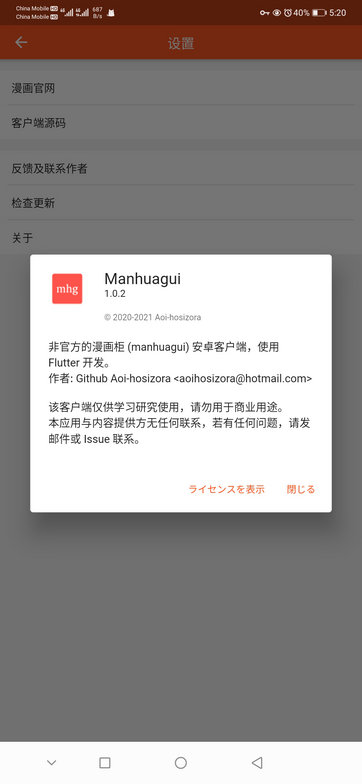

# manhuagui_flutter

+ An unofficial application for manhuagui (https://www.manhuagui.com/) written in flutter.
+ Backend see [Aoi-hosizora/manhuagui-backend](https://github.com/Aoi-hosizora/manhuagui-backend) (private).

### Dependencies

+ See [pubspec.yaml](./pubspec.yaml).

### Install

+ See [Release](https://github.com/Aoi-hosizora/manhuagui_flutter/releases).

### Screenshots

|  |  |  |
|------------------------------------------|------------------------------------------|------------------------------------------|
|  |  |  |
|  |  |  |
