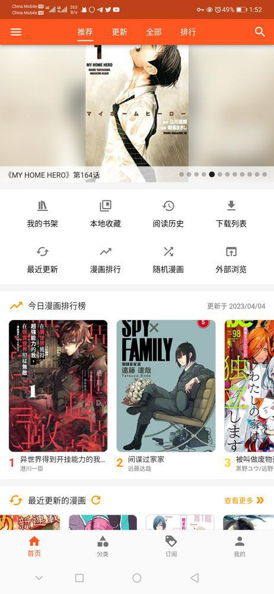

# manhuagui_flutter

+ An unofficial application for manhuagui (https://www.manhuagui.com/), built in flutter.
+ You can visit [Aoi-hosizora/manhuagui-backend](https://github.com/Aoi-hosizora/manhuagui-backend) for backend part, currently this repository is private.

### Dependencies

+ Develop environment: `Flutter 2.10.5 channel stable / Dart 2.16.2`
+ Visit [pubspec.yaml](./pubspec.yaml) for dependent packages.

### Install

+ Visit [Release](https://github.com/Aoi-hosizora/manhuagui_flutter/releases) for released versions.

### Build manually

```bash
cd manhuagui_flutter

# Process sqflite dependency
mkdir -p dependencies
git clone --depth 1 --branch v2.2.5-0 https://github.com/tekartik/sqflite deps/sqflite
sed -i "s/sdk: '>=2.18.0 <3.0.0'/sdk: '>=2.16.2 <3.0.0' # sdk: '>=2.18.0 <3.0.0'/" deps/sqflite/sqflite/pubspec.yaml
sed -i 's/flutter: ">=3.3.0"/# flutter: ">=3.3.0"/' deps/sqflite/sqflite/pubspec.yaml
sed -i "s/sqflite_common: '>=2.4.2+2 <4.0.0'/sqflite_common:\n    path: ..\/sqflite_common/" deps/sqflite/sqflite/pubspec.yaml
sed -i "s/sdk: '>=2.18.0 <3.0.0'/sdk: '>=2.16.2 <3.0.0' # sdk: '>=2.18.0 <3.0.0'/" deps/sqflite/sqflite/example/pubspec.yaml
sed -i "s/sdk: '>=2.18.0 <3.0.0'/sdk: '>=2.16.2 <3.0.0' # sdk: '>=2.18.0 <3.0.0'/" deps/sqflite/sqflite_common/pubspec.yaml
sed -i "s/SqfliteBatchOperation(super.type, this.method, super.sql, super.arguments);/SqfliteBatchOperation(dynamic type, this.method, dynamic sql, dynamic arguments) : super(type, sql, arguments);/" deps/sqflite/sqflite_common/lib/src/batch.dart

# Build apk
flutter pub get
flutter build apk
```

### Screenshots

|  |  |  |  |  |
|------------------------------------------|------------------------------------------|------------------------------------------|------------------------------------------|------------------------------------------|
|  |  |  |  |  |
|  |  |  |  |  |
