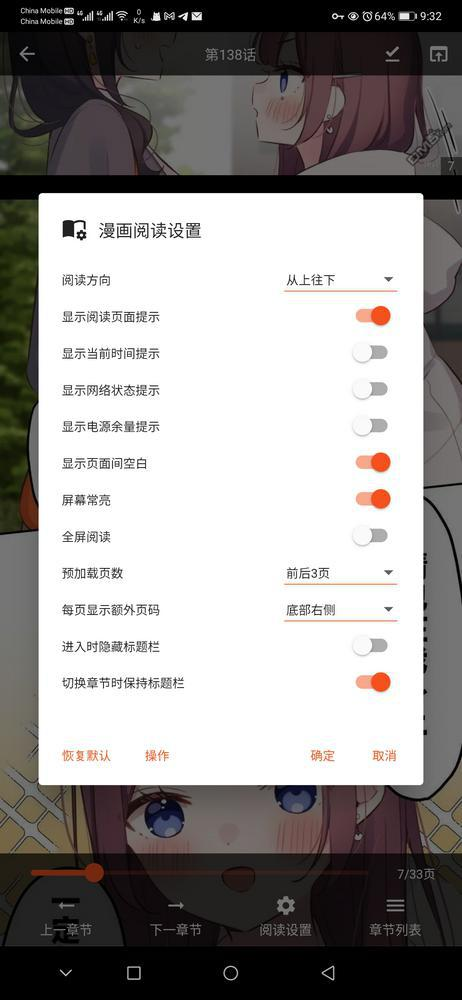
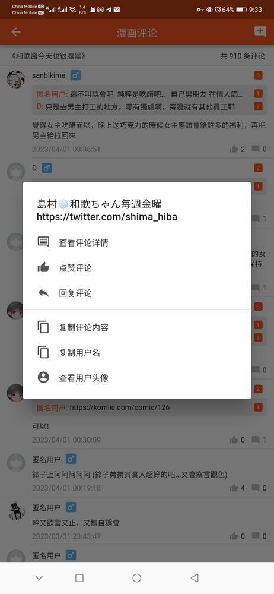

# manhuagui_flutter

+ An unofficial application for manhuagui (https://www.manhuagui.com/), powered by flutter.
+ Develop environment: `Flutter 2.10.5 channel stable / Dart 2.16.2`, visit [pubspec.yaml](./pubspec.yaml) for package dependencies.

### Related repositories

+ [Aoi-hosizora/manhuagui_api](https://github.com/Aoi-hosizora/manhuagui_api): The manhuagui backend used by this client, currently this repository is private.
+ [Aoi-hosizora/flutter_ahlib](https://github.com/Aoi-hosizora/flutter_ahlib): A personal flutter widgets and utilities library, which is used in this project.

### Install

+ Visit [Release](https://github.com/Aoi-hosizora/manhuagui_flutter/releases) for released versions.

### Build manually

```bash
cd manhuagui_flutter

# Process sqflite dependency
mkdir -p deps
git clone --depth 1 --branch v2.2.5-0 https://github.com/tekartik/sqflite deps/sqflite
sed -i "s/sdk: '>=2.18.0 <3.0.0'/sdk: '>=2.16.2 <3.0.0' # sdk: '>=2.18.0 <3.0.0'/" deps/sqflite/sqflite/pubspec.yaml
sed -i 's/flutter: ">=3.3.0"/# flutter: ">=3.3.0"/' deps/sqflite/sqflite/pubspec.yaml
sed -i "s/sqflite_common: '>=2.4.2+2 <4.0.0'/sqflite_common:\n    path: ..\/sqflite_common/" deps/sqflite/sqflite/pubspec.yaml
sed -i "s/sdk: '>=2.18.0 <3.0.0'/sdk: '>=2.16.2 <3.0.0' # sdk: '>=2.18.0 <3.0.0'/" deps/sqflite/sqflite/example/pubspec.yaml
sed -i "s/sdk: '>=2.18.0 <3.0.0'/sdk: '>=2.16.2 <3.0.0' # sdk: '>=2.18.0 <3.0.0'/" deps/sqflite/sqflite_common/pubspec.yaml
sed -i "s/SqfliteBatchOperation(super.type, this.method, super.sql, super.arguments);/SqfliteBatchOperation(dynamic type, this.method, dynamic sql, dynamic arguments) : super(type, sql, arguments);/" deps/sqflite/sqflite_common/lib/src/batch.dart

# Process photo_view dependency
git clone --depth 1 --branch 0.14.0 https://github.com/bluefireteam/photo_view deps/photo_view
sed -i "0,/required this.enablePanAlways,/s//required this.enablePanAlways,\n    this.customBuilder,/" deps/photo_view/lib/src/photo_view_wrappers.dart
sed -i "0,/final bool? enablePanAlways;/s//final bool? enablePanAlways;\n  final Widget Function(BuildContext, Widget)? customBuilder;/" deps/photo_view/lib/src/photo_view_wrappers.dart
sed -i "s/return PhotoViewCore(/var view = PhotoViewCore(/" deps/photo_view/lib/src/photo_view_wrappers.dart
sed -z -i "s/widget.enablePanAlways ?? false,\n    );/widget.enablePanAlways ?? false,\n    );\n    return widget.customBuilder?.call(context, view) ?? view;/" deps/photo_view/lib/src/photo_view_wrappers.dart
sed -i "0,/this.enablePanAlways,/s//this.enablePanAlways,\n    this.customBuilder,/" deps/photo_view/lib/photo_view.dart 
sed -i "s/loadingBuilder = null,/loadingBuilder = null,\n        customBuilder = null,/" deps/photo_view/lib/photo_view.dart
sed -i "s/final bool? enablePanAlways;/final bool? enablePanAlways;\n\n  final Widget Function(BuildContext, Widget)? customBuilder;/" deps/photo_view/lib/photo_view.dart
sed -z -i "s/enablePanAlways: widget.enablePanAlways,\n              );/enablePanAlways: widget.enablePanAlways,\n                customBuilder: widget.customBuilder,\n              );/" deps/photo_view/lib/photo_view.dart

# Process flutter_ahlib reloadable_photo_view.dart
curl -o deps/photo_view/lib/reloadable_photo_view.dart https://raw.githubusercontent.com/Aoi-hosizora/flutter_ahlib/dev.v1.3.0/lib/src/image/reloadable_photo_view.dart
sed -i "0,/this.errorBuilder,/s//this.errorBuilder,\n    this.customBuilder,/" deps/photo_view/lib/reloadable_photo_view.dart
sed -i "0,/final ErrorPlaceholderBuilder? errorBuilder;/s//final ErrorPlaceholderBuilder? errorBuilder;\n\n  final Widget Function(BuildContext, Widget)? customBuilder;/" deps/photo_view/lib/reloadable_photo_view.dart
sed -i "s/errorBuilder: widget.errorBuilder,/errorBuilder: widget.errorBuilder,\n        customBuilder: widget.customBuilder,/" deps/photo_view/lib/reloadable_photo_view.dart

# Build apk
flutter pub get
flutter build apk
```

### Screenshots

|  |  |  |  |  |
|------------------------------------------|------------------------------------------|------------------------------------------|------------------------------------------|------------------------------------------|
|  |  |  |  |  |
|  |  |  |  |  |
