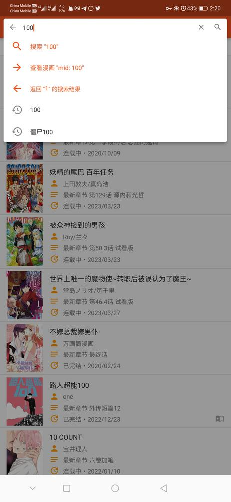
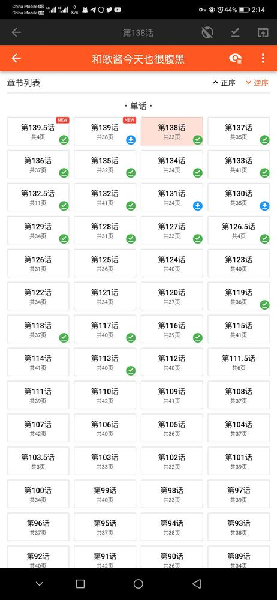
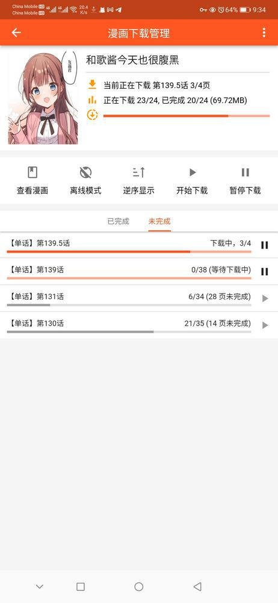

  
  
  
  
  

## Main repositories

+ [Aoi-hosizora/manhuagui_flutter](https://github.com/Aoi-hosizora/manhuagui_flutter): The unofficial manhuagui android application.

    
    
    
    
    

+ [Aoi-hosizora/manhuagui_api](https://github.com/Aoi-hosizora/manhuagui_api): The unofficial manhuagui backend system.

    
    
    
    
    

## Related repositories

+ [Aoi-hosizora/flutter_ahlib](https://github.com/Aoi-hosizora/flutter_ahlib): A personal flutter widgets and utilities library.
+ [Aoi-hosizora/ahlib](https://github.com/Aoi-hosizora/ahlib): A personal golang utilities library.

## Tips

+ Manhuagui is a free and open-source software, and is released under the **MIT License**, but commercial use is **FORBIDDEN**.
+ Copyright (c) 2020-2023 AoiHosizora (青いほしぞら). Visit [LICENSE](./LICENSE) for details.
+ Note: Some UI in this application is referenced from [动漫之家](http://www.idmzj.com/), [ガンマ!](https://ganma.jp/) and [Ehviewer](https://github.com/xiaojieonly/Ehviewer_CN_SXJ) android client.
+ Some disclaimers and statements in Simplified Chinese:
    1. 本应用仅供学习使用，客户端和服务端代码完全开源，仅供非商业用途。
    2. 本应用与漫画柜内容提供方无任何关系，若有问题，请发邮件或 Issue 联系。

## Screenshots

|    |    |    |    |    |    |    |
|--------------------------------------------|--------------------------------------------|--------------------------------------------|--------------------------------------------|--------------------------------------------|--------------------------------------------|--------------------------------------------|
|    |    |  |  |  |  |  |
|  |  |  |  |  |  |  |
